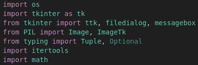

<a id="back-top"></a>
<div align="center">
  
</div>

# Imagizer App

<!-- TABLE OF CONTENTS -->
<details>
  <summary>Table of Contents</summary>
  <ol>
    <li>
      <a href="#about-the-project">About The Project</a>
      <ul>
        <li><a href="#️-built-with">Built With</a></li>
      </ul>
    </li>
    <li>
      <a href="#getting-started">Getting Started</a>
      <ul>
        <li><a href="#-technical-requirements">Technical Requirements</a></li>
        <li><a href="#️-how-to-use-the-app">How to Use the App</a></li>
        <li><a href="#running-the-app-on-linuxwindows">Running the app on Linux/Windows</a></li>
        <li><a href="#running-the-app-on-macos">Running the app on macOS</a></li>
      </ul>
    </li>
    <li><a href="#-how-does-imagizer-work">How does Imagizer work</a></li>
    <li><a href="#-report-bugs--issues">Report Bugs & Issues</a></li>
    <li><a href="#license">License</a></li>
    <li><a href="#contact">Contact</a></li>
  </ol>
</details>

---

<!-- ABOUT THE PROJECT -->
## About The Project

This is a productivity-boosting app I built to streamline the process of resizing, renaming, compressing and converting large batches of images when preparing them for deployment in an application or on a Website where performance is needed. If you often find yourself working with many pictures that need to be processed in bulk, this tool might just save you a ton of time!

Image processing functionalities the app offers:
* Image Resizing
* Image Renaming
* Image Conversion (any image filetype to .webp)
* WEBP Image Compression
* A Wizard combining all the functions *COMING SOON...*


### ⚙️ Built With

This app was built using Python and various Python libraries. It offers a python GUI built with tkinter. More details about the tehnologies used can be found in the Requirements section.

[![Python][Python]][Python-url]

<!-- GETTING STARTED -->
## Getting Started

This is an example of how you may give instructions on setting up your project locally.
To get a local copy up and running follow these simple example steps.

### 🚀 Technical Requirements

Below is a picture with all the imported libraries that are required for this app to work.



You can easily install all required packages with the help of the *requirements.txt* file by running the following command (You need to have *python3* and *pip3* installed):

*COMING SOON...*
bash:
  ```sh
pip3 install -r requirements.txt
  ```
<!-- HOW TO USE THE APP -->
### 🛠️ How to Use the App

To install the application simply clone the git repository locally and run the requirements installation command to install all the required packages. Afterwards just run the python file and you are good to go.

### Running the app on Linux/Windows

1. Clone the repo
   ```sh
   git clone https://github.com/Mihai-Bogdan-Robert/Image-optimizer-for-websites.git
   ```
2. Run the program
   ```sh
   python3 ./Imagizer.py
   ```

*In the near future there will be a single executable file that handles everything. COMING SOON...*

### Running the app on macOS
*COMING SOON...*

<!-- HOW DOES IMAGIZER WORK -->
## ✨ How does Imagizer work

Imagizer application is split into 4 different tabs acoording to the functionalities:
* Resize Images
* Rename Images
* Convert Images
* Compress Images

By clicking a tab you will be taken to the page for that specific functionality.

#### Image Resizer

The Image resizer works by taking all the selected Images as an input and looking for the longer side of the image (Length or Width) and if the longer side is larger than *1600px* then the image gets resized so that the longer side has less than *1600px*. You also have a preview for all images before and after the resizing.

#### Image Renamer

The Image renamer works by taking *n* number of images as an input. And computing the smallest factorial number *x!* that is larger or equal to *n*. Afterwards it prompts you to enter at least *x* different keywords separated by a comma (*keyword1,keyword2, ...*). It then computes all the permutations of the keywords and uses each permutation for each image and concatenates the keywords sepparating them by a *'_'*. In the end the names of the pictures will look like this: *picture1: keyword1_keyword2_keyword3 picture2: keyword1_keyword3_keyword2* . There is also a *"Preview Names"* functionality that lets you see all the names that will be generated. This way of renaming pictures is very good for SEO and Web optimization.
NOTE! You need to enter at least the number of keywords specified by the program for this to work.

#### Image Converter

The Image Converter like the name suggests converts any picture format into *.webp* format. In the conversion you can choose how much of the original quality is maintained (recommended above 80% for maximum quality). This operation can be done in batches.

#### Webp Image Compresser

The Compresser only accepts webp files and it essentialy compresses you images with the setting sof your choice.

<!-- BUGS AND ISSUES -->
## 🐞 Report Bugs & Issues

If you come across any errors or bugs while using the app, please don't hesitate to [notify me](mailto:bogdanmihairobert@gmail.com) or open an issue in the repository. Your feedback helps improve the app!

<!-- LICENSE -->
## License

Distributed under the MIT License. See `LICENSE.txt` for more information.

<!-- CONTACT -->
## Contact

Bogdan Mihai Robert - https://www.linkedin.com/in/mihai-robert-bogdan/

Thanks for checking out the project! 👨‍💻✨

<p align="right"><a href="#back-top"><i class="fas fa-arrow-up"></i></a></p>

<!-- MARKDOWN LINKS & IMAGES -->
[Python]: https://www.python.org/static/img/python-logo.png
[Python-url]: https://www.python.org/